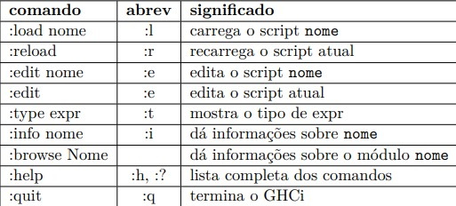

# HASKELL
### Haskell é uma linguagem de programação funcional pura avançada.
 1. GHC (Glasgow Haskell Compiler)2
é um compilador de código aberto para a linguagem Haskell, disponível para diversas plataformas, incluindo Windows e diversas
variedades de Unix.

2. GHC compreende um compilador de linha de comando (ghc) usado para compilar
programas gerando código executável, e também um ambiente interativo (GHCi),
que permite a avaliação de expressões de forma interativa, muito útil para testes
durante o desenvolvimento.

#### O GHCi pode ser iniciado a partir de um terminal digitando ghci. O prompt Prelude> significa que o sistema GHCi está pronto para avaliar expressões.

```bash 
usuario> ghci
GHCi, version 8.10.7: https://www.haskell.org/ghc/ :? for help
Prelude>
```

```bash 
Prelude> 2 + 3 * 4
14
Prelude> (2 + 3) * 4
20
Prelude> sqrt (3^2 + 4^2)
5.0
```

4. Bibliotecas
Os programas em Haskell são organizados em módulos. Um módulo é formado por
um conjunto de definições (tipos, variáveis, funções, etc.). Para que as definições
de um módulo possam ser usadas o módulo deve ser importado. Uma biblioteca é
formada por uma coleção de módulos relacionados.
Todas as definições de um módulo podem ser listadas no ambiente interativo
usando o comando :browse. Por exemplo

```bash 
Prelude> :browse Prelude
($!) :: (a -> b) -> a -> b
(!!) :: [a] -> Int -> a
($) :: (a -> b) -> a -> b
(&&) :: Bool -> Bool -> Bool
(++) :: [a] -> [a] -> [a]
(.) :: (b -> c) -> (a -> b) -> a -> c
(=<<) :: Monad m => (a -> m b) -> m a -> m b
data Bool = False | True
(...)
```
### comandos úteis 


### Elementos Básicos em Haskell
```bash
Prelude> sqrt 25
5.0
Prelude> cos 0
1.0
Prelude> max 3 56
56
Prelude> min 3 56
3
Prelude> not True
False
```

### Podemos nomear valores 
```bash 
Prelude> 2 + 3 * 4
14
Prelude> it
14
Prelude> 7*(it - 4)
70
Prelude> it
70
```

### podemos declarar uma variável
```bash 
Prelude> let idade = 2 + 3 * 4
Prelude> idade
14
Prelude> 7*(idade - 4)
70

```
